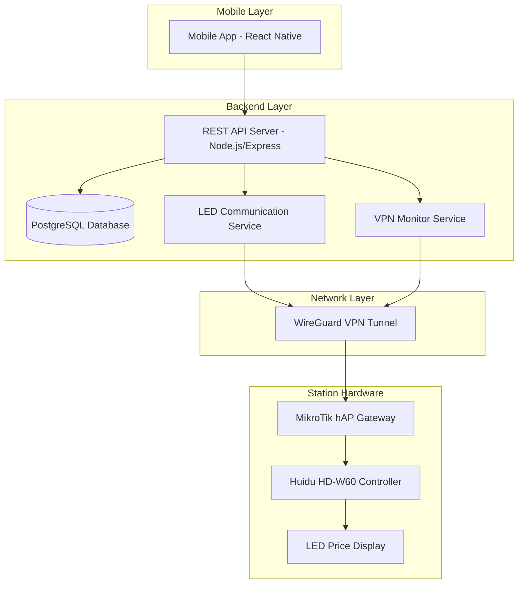

# Design Document: FuelPrice Pro

## Overview

FuelPrice Pro is a distributed IoT system that enables remote management of LED pricing displays at gas stations through a secure VPN infrastructure. The system consists of three main components: a Node.js backend server, a React Native mobile application, and hardware integration with Huidu HD-W60 LED controllers connected via MikroTik VPN gateways.

The architecture prioritizes security by routing all LED panel communication through a central backend server, eliminating direct internet exposure of hardware devices. Real-time status monitoring ensures operators can quickly identify and resolve connectivity issues.

## Architecture



The system uses a hub-and-spoke network topology where each gas station connects to the central backend through individual WireGuard VPN tunnels. This design provides network isolation, centralized management, and secure communication channels.

## Components and Interfaces

### Mobile Application (React Native)

**Station Dashboard Component**
- Displays grid of station cards with real-time status indicators
- Shows current fuel prices and last update timestamp
- Provides visual feedback for online/offline status using color coding
- Implements pull-to-refresh for manual status updates

**Price Editor Component**
- Large numeric keypad optimized for outdoor visibility
- Separate input fields for different fuel types (Regular, Premium, Diesel)
- Real-time validation with visual feedback for invalid inputs
- "Sync All" button with confirmation dialog and progress indicators

**Authentication Component**
- Secure login form with role-based access control
- Biometric authentication support where available
- Session management with automatic timeout and renewal

### Backend API Server (Node.js/Express)

**Authentication Service**
```javascript
interface AuthService {
  authenticate(credentials: LoginCredentials): Promise<AuthToken>
  validateToken(token: string): Promise<UserSession>
  refreshToken(token: string): Promise<AuthToken>
}
```

**Station Management Service**
```javascript
interface StationService {
  getStationsByUser(userId: string): Promise<Station[]>
  updateStationStatus(stationId: string, status: ConnectionStatus): Promise<void>
  getStationDetails(stationId: string): Promise<StationDetails>
}
```

**Price Update Service**
```javascript
interface PriceUpdateService {
  updatePrices(stationId: string, prices: FuelPrices): Promise<UpdateResult>
  validatePriceData(prices: FuelPrices): ValidationResult
  sendToLEDPanel(ipAddress: string, command: HuiduCommand): Promise<boolean>
}
```

### VPN Monitoring Service

**Heartbeat Manager**
- Maintains persistent connections to all registered stations
- Sends ICMP pings every 30 seconds to verify tunnel connectivity
- Updates database with connection status and last seen timestamps
- Implements exponential backoff for failed connections

**Connection Status Tracker**
```javascript
interface ConnectionTracker {
  startMonitoring(stationId: string, vpnIP: string): void
  stopMonitoring(stationId: string): void
  getConnectionStatus(stationId: string): ConnectionStatus
  onStatusChange(callback: (stationId: string, status: ConnectionStatus) => void): void
}
```

### LED Communication Service

**Huidu Protocol Handler**
- Implements Huidu HD-W60 communication protocol
- Handles frame construction with proper headers, checksums, and footers
- Manages TCP socket connections with timeout handling
- Provides retry logic for failed transmissions

**Protocol Frame Structure**
```
[STX][CMD][LEN][DATA][CRC16][ETX]
 0x02 0x31  N   ...   ....  0x03
```

## Data Models

### User Model
```typescript
interface User {
  id: string;
  username: string;
  passwordHash: string;
  role: 'admin' | 'owner';
  createdAt: Date;
  lastLogin: Date;
}
```

### Station Model
```typescript
interface Station {
  id: string;
  ownerId: string;
  name: string;
  vpnIpAddress: string;
  isOnline: boolean;
  lastSync: Date;
  location?: {
    latitude: number;
    longitude: number;
    address: string;
  };
  panels: LEDPanel[];
}
```

### LED Panel Model
```typescript
interface LEDPanel {
  id: string;
  stationId: string;
  name: string; // e.g., "Main Totem", "Pump 1"
  currentPrices: FuelPrices;
  lastUpdate: Date;
}
```

### Fuel Prices Model
```typescript
interface FuelPrices {
  regular: number;
  premium: number;
  diesel: number;
  [fuelType: string]: number;
}
```

### Huidu Command Model
```typescript
interface HuiduCommand {
  header: 0x02;
  command: 0x31;
  length: number;
  data: Buffer;
  checksum: number;
  footer: 0x03;
}
```

## Error Handling

### Network Error Handling
- **Connection Timeouts**: 5-second timeout for TCP connections with automatic retry
- **VPN Tunnel Failures**: Graceful degradation with offline mode and queued updates
- **Malformed Responses**: Validation and sanitization of all incoming data

### Application Error Handling
- **Authentication Failures**: Rate limiting and account lockout protection
- **Invalid Price Data**: Client-side and server-side validation with descriptive error messages
- **Database Errors**: Connection pooling with automatic reconnection and transaction rollback

### Hardware Error Handling
- **LED Panel Unresponsive**: Retry mechanism with exponential backoff (3 attempts max)
- **Checksum Validation Failures**: Automatic retransmission with error logging
- **Protocol Violations**: Graceful error recovery with detailed logging for debugging

## Correctness Properties

*A property is a characteristic or behavior that should hold true across all valid executions of a system—essentially, a formal statement about what the system should do. Properties serve as the bridge between human-readable specifications and machine-verifiable correctness guarantees.*

### Property 1: Authentication and Authorization Correctness
*For any* user credentials and system state, authentication should succeed if and only if the credentials are valid, and access should be granted only to resources matching the user's role permissions.
**Validates: Requirements 1.1, 1.2, 1.3, 1.4, 1.5**

### Property 2: Station Data Consistency  
*For any* user and station query, the returned station list should contain exactly the stations the user is authorized to access, with accurate real-time status information.
**Validates: Requirements 2.1, 2.2, 2.3**

### Property 3: Price Validation and Range Enforcement
*For any* price input data, the system should accept values if and only if they are positive numbers within the range 0.01 to 999.99 with appropriate decimal precision.
**Validates: Requirements 3.2, 7.3**

### Property 4: Price Update Distribution
*For any* station with multiple LED panels, when a "Sync All" operation is triggered, all panels at that station should receive the same price update data.
**Validates: Requirements 3.3, 3.5**

### Property 5: Huidu Protocol Compliance
*For any* price update command, the generated protocol frame should have header 0x02, footer 0x03, UTF-8 encoded data, and a valid CRC16-CCITT checksum, transmitted over TCP port 5005.
**Validates: Requirements 3.4, 4.1, 4.3, 4.4, 4.5**

### Property 6: Retry Logic Consistency
*For any* failed price update operation, the system should retry exactly 3 times before reporting failure, and should verify VPN connectivity before each transmission attempt.
**Validates: Requirements 3.6, 4.2**

### Property 7: Data Persistence Completeness
*For any* station or price update operation, all required data fields should be persisted to the database with accurate timestamps and status information.
**Validates: Requirements 5.1, 5.2, 5.3, 5.4**

### Property 8: Security and Input Sanitization
*For any* input data, the system should sanitize and validate all inputs, encrypt sensitive data in storage, and log security events when malicious data is detected.
**Validates: Requirements 7.1, 7.2, 7.4, 7.5**

### Property 9: Connection Status Management
*For any* station heartbeat sequence, the system should update timestamps on successful responses, mark stations offline after 3 consecutive failures, and immediately restore online status when connectivity returns.
**Validates: Requirements 8.2, 8.3, 8.4, 8.5**

### Property 10: UI Data Display Accuracy
*For any* authorized user and station data, the mobile interface should display complete station information including current prices, connection status, and appropriate visual feedback for network conditions.
**Validates: Requirements 6.1, 6.5**

## Testing Strategy

The testing approach combines unit tests for individual components with property-based tests to verify system-wide correctness properties. This dual approach ensures both specific functionality and general system behavior are validated.

**Unit Testing Focus Areas:**
- Authentication and authorization logic
- Price validation and sanitization  
- Database operations and data integrity
- Network error handling and recovery
- Protocol frame construction and parsing
- Specific UI interactions and navigation flows

**Property-Based Testing Configuration:**
- Use `fast-check` library for JavaScript property-based testing
- Configure each test to run minimum 100 iterations for comprehensive coverage
- Tag each test with format: **Feature: fuel-price-management, Property {number}: {property_text}**
- Each correctness property must be implemented by a single property-based test

**Integration Testing:**
- End-to-end API testing with real database connections
- Mock LED panel responses for protocol testing
- VPN connectivity simulation for network failure scenarios
- Cross-platform mobile app testing on iOS and Android